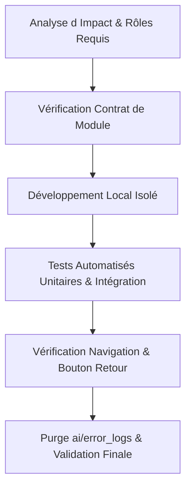

# 🛡️ Skill : Dioufy Safe Delivery

Ce skill régit toutes les interventions techniques sur la plateforme **Dioufy-TS** (*Fo nek sa gare fek lafa*).
Il applique les principes d'ingénierie de haute fiabilité pour les systèmes critiques combinant transports, billettique et flux monétaires au Sénégal (zone UEMOA / BCEAO).

---

## 🎯 1. Principes Fondamentaux

1. **Analyse d'Impact Préalable** : Avant toute modification de code, évaluer l'impact sur les 3 couches : Base de données (RLS/RPC), Logique métier (Services/RBAC) et Interface utilisateur (Flutter/Web).
2. **Dimensionnement Proportionné au Risque** : Adapter l'ampleur de la solution au problème réel sans introduire de sur-ingénierie ou de complexité accidentelle.
3. **Monolithe Modulaire Compilé** : Une seule base de code structurée par domaines métier étanches (*Bounded Contexts*). Les modules sont compilés dans le binaire ; ils sont activés ou désactivés par Feature Flags (« **Désactiver ≠ Supprimer** »).
4. **Zéro Écran Blanc** : Tout échec réseau ou d'API doit afficher un état de repli élégant (*Graceful Degradation*), un cache local ou un message d'action clair avec bouton retour.
5. **Devise Exclusive FCFA (XOF)** : Aucun symbole dollar `$` dans l'application. Affichage sous forme de badge circulaire `XOF` ou suffixe `FCFA`.

---

## 🚦 2. Garde-Fous de Production Inviolables

### 2.1. Finances & Paiements (BCEAO / UEMOA)
* **Calculs Financiers 100% Côté Serveur** : Aucun calcul de commission, de tarif net ou de répartition de solde n'est confié au frontend client.
* **Refus d'Exécution Hors-Ligne** : Les mutations financières (encaissements, clôtures de caisse, virements Wave/Orange Money) sont **strictement interdites en mode hors-ligne** et requièrent une confirmation distante certifiée.
* **Transactions Atomiques & Idempotence** : Utilisation systématique de transactions SQL ou de clés d'idempotence pour prévenir les doubles débits.

### 2.2. Sécurité & RBAC Anti-Élévation
* **Hiérarchie Typée à 7 Niveaux** : `super_admin` (0), `platform_admin` (1), `gie_admin` (2), `driver` (3), `coxeur` (3), `mechanic` (3), `passenger` (4).
* **Règle Anti-Élévation Absolue** : Aucun rôle ne peut créer, modifier ou révoquer un Super Admin, à l'exception exclusive d'un Super Admin authentifié.
* **Protection Anti-Suicide** : Interdiction technique de supprimer ou désactiver le dernier Super Admin actif.
* **Isolation Multi-Tenancy (GIE)** : Les gestionnaires de coopératives sont strictement confinés à leur `organization_id`.
* **Snapshot Scellé avec TTL (30 minutes)** : Tout privilège mis en cache expire après 30 minutes.

### 2.3. Base de Données Supabase & PostgreSQL
* **Fonctions `SECURITY DEFINER` Durcies** : Définir systématiquement `SET search_path = pg_catalog, public` et qualifier chaque table (`public.trips`, `public.seats`).
* **Politiques RLS Étanches** : Chaque table doit avoir `ENABLE ROW LEVEL SECURITY` et des politiques explicites par rôle.
* **Migrations Idempotentes & Réversibles** : Scripts de migration avec clauses `IF NOT EXISTS` et scripts de rollback documentés.

---

## 📋 3. Cycle de Vie des Modifications (Workflow)

1. **Étape 1 : Cadrage & Rôles** — Identifier les expertises mobilisées (voir [`expert-roles.md`](references/expert-roles.md)).
2. **Étape 2 : Contrat de Module** — Vérifier le respect du contrat (voir [`module-contract.md`](references/module-contract.md)).
3. **Étape 3 : Implémentation Locale** — Développement local strict (zéro push non validé).
4. **Étape 4 : Validation par les Tests** — Exécuter `flutter test` et garantir 100% de réussite.
5. **Étape 5 : Hygiène du Projet** — Purgation immédiate de tout journal d'erreur (`ai/error_logs`).
